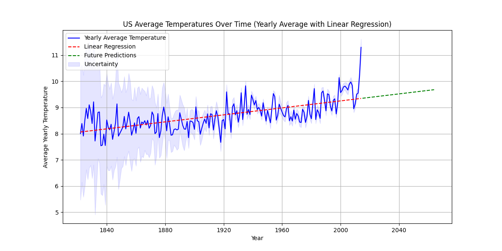

## Project Overview
This project aims to analyze the average temperatures of the United States over time using linear regression. The dataset used in this project is the "Global Land Temperatures By Country" dataset, which includes temperature records for various countries. The project involves data preprocessing, fitting a linear regression model to the data, and visualizing trends to make future predictions.

## Features
- Data Cleaning: Handling missing values using forward fill and filtering out inaccurate data before 1820.
- Yearly Resampling: Resampling the temperature data to obtain yearly average temperatures.
- Linear Regression: Using linear regression to fit a trend line and predict future temperatures for 50 years.
- Uncertainty Calculation: Calculating the upper and lower bounds of uncertainty in the average temperature estimates.

## Tools and Libraries
- **Python**: Main programming language used for analysis.
- **Pandas**: Data manipulation and preprocessing.
- **NumPy**: Numerical operations.
- **Matplotlib**: Data visualization.
- **scikit-learn**: Linear regression model.

## Future Work
- Implement additional statistical tests to evaluate model assumptions such as linearity, independence, homoscedasticity, and normality.
- Explore different models such as polynomial regression or time series analysis to better capture non-linear patterns in temperature trends.

## Acknowledgments
- Dataset provided by [Kaggle](https://www.kaggle.com/datasets/berkeleyearth/climate-change-earth-surface-temperature-data).

